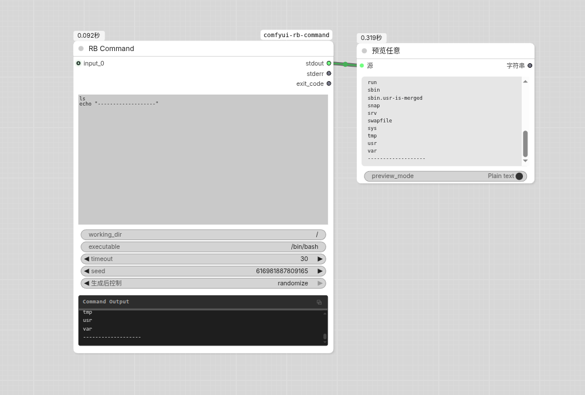

# ComfyUI RB Command

Execute shell commands/scripts with dynamic inputs, and result caching. Supports placeholders ({input0}, {input0_0}, {seed}) and environment variables ($INPUT_0, $SEED, etc.). 



## Features

- **Command Execution**: Run arbitrary shell commands and scripts via `/bin/bash` (configurable)
- **Dynamic Input Slots**: Automatically expand input slots on connection (up to 20), supporting images, audio, video, text, and more
- **Input Bundle Node**: Group multiple inputs into a single slot with `{inputN_0}`, `{inputN_1}`, `{inputN_count}` syntax
- **Bundle Pass Node**: Pass through a bundle input unchanged, useful for routing bundles through the graph
- **Placeholder Substitution**: Use `{input0}`, `{input1}`, ... placeholders in commands to reference inputs
- **Environment Variables**: Access parameters via `$INPUT_0`, `$INPUT_1`, ...
- **Timeout Protection**: Configurable timeout (1-3600 seconds), auto-terminates on timeout
- **Separate Outputs**: stdout, stderr, and exit code are returned as distinct outputs for flexible workflow routing

## Installation

```bash
cd ComfyUI/custom_nodes/
git clone https://github.com/itribs/comfyui-rb-command.git
pip install -r requirements.txt
```

## Parameters

### Required

| Parameter | Type | Default | Description |
|-----------|------|---------|-------------|
| `command` | STRING (multiline) | `echo input: {input0} seed: {seed}` | Shell command to execute, supports placeholders |
| `seed` | INT | `0` | Random seed, accessible via `{seed}` or `$SEED` |
| `working_dir` | STRING | current working directory | Working directory for command execution |
| `executable` | STRING | `/bin/bash` | Shell interpreter to use |
| `timeout` | INT | `30` | Timeout in seconds (1-3600) |

### Optional (Dynamic Input Slots)

| Parameter | Type | Description |
|-----------|------|-------------|
| `input_0` | `*` (any type) | First input slot. Connecting triggers `input_1`, and so on, up to 20 slots |

### RB Command Input Bundle

The **RB Command Input Bundle** node groups multiple inputs into a single output that can be connected to one RB_Command input slot. 

| Parameter | Type | Description |
|-----------|------|-------------|
| `input_0` | `*` (any type) | First bundled input. Connecting triggers more slots, up to 20 |

**Output:** A bundle that can be connected to any RB_Command `inputN` slot. Bundle-to-bundle connections are not supported — connect each bundle to a separate RB_Command input slot instead.

In the command, access individual bundled items:
```bash
# {input0_0} = path of Image A, {input0_1} = Image B, {input0_2} = Image C
# {input0_count} = 3
# {input0} = all three values space-separated
```

### RB Command Input Bundle Pass

The **RB Command Input Bundle Pass** node is a simple pass-through that takes a bundle as input and outputs it unchanged. It is useful for routing bundles through the graph, e.g., to fan out a single bundle to multiple RB_Command nodes.

| Parameter | Type | Description |
|-----------|------|-------------|
| `bundle` | `RB_COMMAND_INPUT_BUNDLE` | The bundle input to pass through unchanged |

**Output:** The same bundle, unchanged.


## Outputs

| Output | Type | Description |
|--------|------|-------------|
| `stdout` | STRING | Standard output from the command |
| `stderr` | STRING | Standard error from the command |
| `exit_code` | INT | Exit code (0 = success, non-zero = error) |

## Placeholder Syntax

Use the following placeholders in the `command` field:

| Placeholder | Description |
|-------------|-------------|
| `{input0}`, `{input1}`, ... | Input slot value (auto-quoted). For bundle inputs, all bundled values are joined with spaces |
| `{inputN_0}`, `{inputN_1}`, ... | Individual item in a bundle at `inputN` (auto-quoted) |
| `{inputN_count}` | Number of items in the bundle at `inputN` (1 for non-bundle inputs) |
| `{input_count}` | Total number of input values after flattening bundles |
| `{input_all}` | All input values, bundles flattened, in input order (auto-quoted, suitable for bash array expansion) |
| `{input_images}` | All image input paths, bundles flattened, in input order (auto-quoted, suitable for bash array expansion) |
| `{input_videos}` | All video input paths, bundles flattened, in input order (auto-quoted, suitable for bash array expansion) |
| `{input_audios}` | All audio input paths, bundles flattened, in input order (auto-quoted, suitable for bash array expansion) |
| `{input_image_count}` | Number of image-type inputs (includes items inside bundles) |
| `{input_video_count}` | Number of video-type inputs (includes items inside bundles) |
| `{input_audio_count}` | Number of audio-type inputs (includes items inside bundles) |
| `{seed}` | Seed value |

Examples:

```bash
# Merge two videos with ffmpeg
ffmpeg -i {input0} -i {input1} -filter_complex "[0:v][1:v]hstack" output.mp4

# Resize image with ImageMagick
convert {input0} -resize 512x512 -quality 90 output.jpg

# Call a Python script
python3 /path/to/script.py --input {input0} --seed {seed}

# Batch process all inputs via bash array
arr=({input_all})
for f in "${arr[@]}"; do
    echo "Processing: $f"
    convert "$f" -resize 256x256 "${f%.*}_thumb.png"
done

# Conditional logic based on input counts
if [ "$INPUT_IMAGE_COUNT" -gt 0 ]; then
    echo "Processing ${INPUT_IMAGE_COUNT} images, ${INPUT_VIDEO_COUNT} videos, ${INPUT_AUDIO_COUNT} audio files"
fi

# Process bundled inputs individually
for i in $(seq 0 $((INPUT_0_COUNT - 1))); do
    eval "path=\$INPUT_0_$i"
    echo "Processing: $path"
done

# Batch process only images (type-filtered)
eval "images=($INPUT_IMAGES)"
for img in "${images[@]}"; do
    convert "$img" -resize 512x512 "${img%.*}_thumb.png"
done

# Batch process only videos (type-filtered)
eval "videos=($INPUT_VIDEOS)"
for vid in "${videos[@]}"; do
    ffmpeg -i "$vid" -vf scale=640:-1 "${vid%.*}_small.mp4"
done
```

## Environment Variables

The following environment variables are available during command execution:

| Variable | Description |
|----------|-------------|
| `$INPUT_0`, `$INPUT_1`, ... | Input slot value (space-joined for bundle inputs) |
| `$INPUT_N_0`, `$INPUT_N_1`, ... | Individual item in a bundle at `INPUT_N` (e.g., `$INPUT_0_0` for the first item) |
| `$INPUT_N_COUNT` | Number of items in the bundle at `INPUT_N` (e.g., `$INPUT_0_COUNT`) |
| `$SEED` | Seed value |
| `$INPUT_COUNT` | Total number of input values after flattening bundles |
| `$INPUT_ALL` | All input values, bundles flattened, in input order (auto-quoted, suitable for bash array expansion) |
| `$INPUT_IMAGES` | All image input paths, bundles flattened, in input order (auto-quoted, suitable for bash array expansion) |
| `$INPUT_VIDEOS` | All video input paths, bundles flattened, in input order (auto-quoted, suitable for bash array expansion) |
| `$INPUT_AUDIOS` | All audio input paths, bundles flattened, in input order (auto-quoted, suitable for bash array expansion) |
| `$INPUT_IMAGE_COUNT` | Number of image-type inputs (includes bundles) |
| `$INPUT_VIDEO_COUNT` | Number of video-type inputs (includes bundles) |
| `$INPUT_AUDIO_COUNT` | Number of audio-type inputs (includes bundles) |

Example:

```bash
# Batch process all inputs via bash array (handles spaces, quotes, newlines correctly)
eval "arr=($INPUT_ALL)"
for f in "${arr[@]}"; do
    echo "Processing: $f"
    convert "$f" -resize 256x256 "${f%.*}_thumb.png"
done
```

## Supported Input Types

The node accepts the following ComfyUI data types and converts them for use in commands:

| Type | Handling |
|------|----------|
| Image | Converted to temporary PNG file |
| Video | Converted to temporary MP4 file |
| Audio | Converted to temporary WAV file |
| Text (`str`, `int`, `float`, `bool`) | Converted to string representation |

## License

MIT License